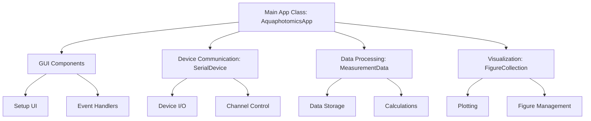
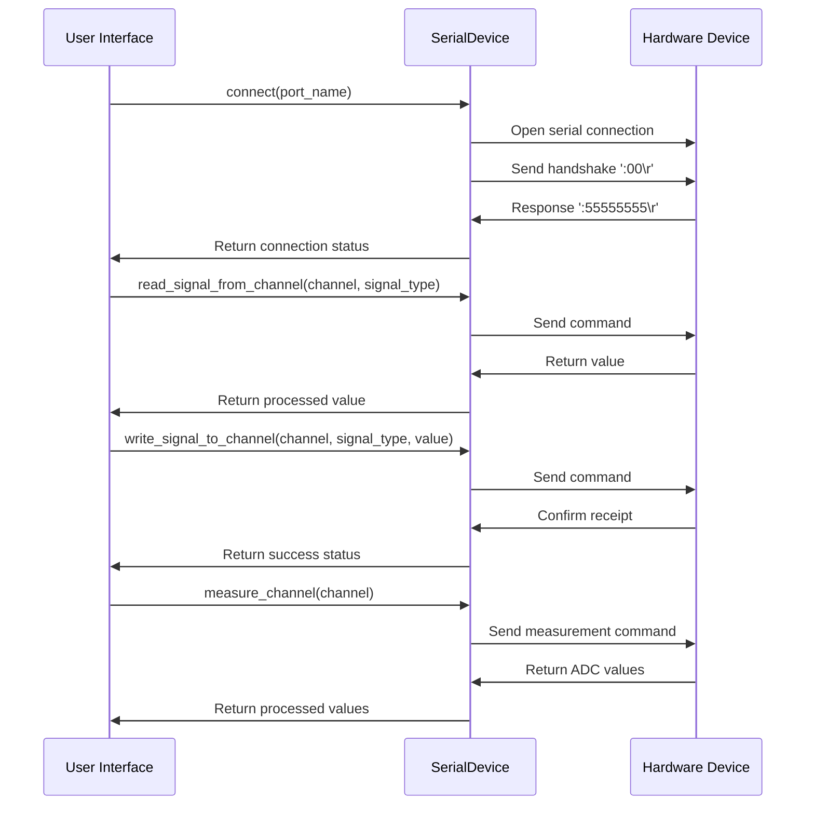
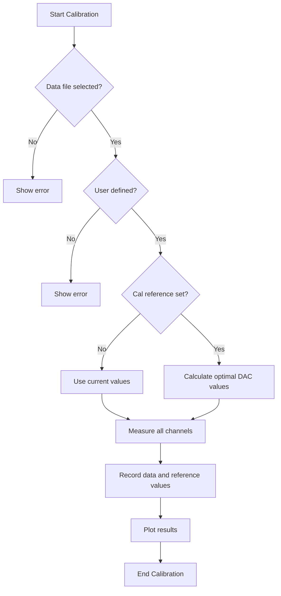
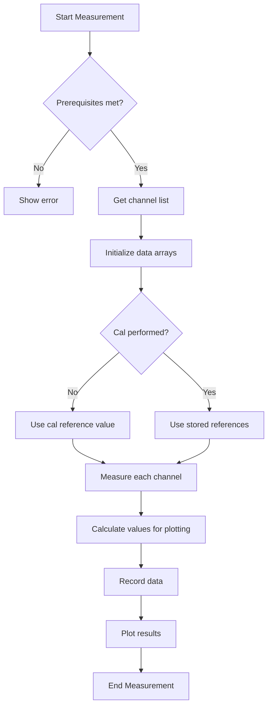
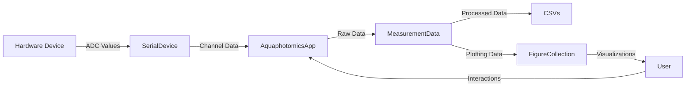

# Aquaphotomics Application Code Analysis

## Overview
This README provides an in-depth analysis of the `aquaphotomics_refactored.py` file, which is the core Python component of the Aquaphotomics Application. This spectroscopic data analysis application processes Near-Infrared (NIR) spectra for various analytical purposes.

## Application Architecture



## Core Components

### 1. GUI Structure
The application follows a traditional Tkinter structure with several key UI sections:

#### Main Window Setup
- **AquaphotomicsApp.__init__()**: Initializes the application window, loads resources, and sets up state variables
- **setup_menubar()**: Creates the main menu with User, Device, Measurement, and Help sections
- **setup_top_controls()**: Builds the top control bar with device connection, file selection, and measurement buttons
- **setup_table()**: Creates the channel configuration table with 16 rows for wavelengths
- **setup_bottom_controls()**: Creates the bottom controls for configuration and sample management

#### Dialog Windows
- **UserDialog**: Manages user profile creation and file selection
- **ConnectionDialog**: Handles device connections and port selection
- **SampleListDialog**: Provides interface for editing sample type lists

### 2. Event Handlers and Function Flow

#### User Functions
- **new_user()**: Creates a new user profile and sets up data files
- **select_data_file()**: Selects/creates data files for measurements
- **edit_sample_list()**: Manages the sample type list

#### Device Functions
- **check_com()**: Verifies COM port connection
- **connect_device()**: Opens the connection dialog
- **toggle_led()**: Controls individual channel LEDs
- **read_channel_data()**: Reads configuration for a specific channel
- **write_channel_data()**: Writes configuration to a specific channel
- **measure_channel()**: Measures ADC values for a specific channel
- **read_table()**: Reads configuration for all channels
- **write_table()**: Writes configuration for all channels

#### Measurement Functions
- **calibration()**: Performs calibration, adjusting DAC values for target ADC readings
- **measurement()**: Takes measurements across enabled channels
- **measurement_multiple()**: Takes multiple measurements and averages them

### 3. Data Processing Flow

#### Device Communication (SerialDevice class)


#### Measurement Data Processing (MeasurementData class)
- **set_data_file()**: Creates data files with appropriate headers
- **record_data()**: Records raw measurement data to CSV
- **record_amplitude()**: Calculates and records processed amplitude data

### 4. Calculation Logic

The core calculation happens in the **record_amplitude()** method:

1. For each measured channel:
   ```python
   # Convert ADC readings using logarithmic transformation
   Im_white_1 = mp.mpf(mp.power(mp.mpf(10.0), 2.0 * Kadc * m_adc_1))
   Im_white_2 = mp.mpf(mp.power(mp.mpf(10.0), 2.0 * Kadc * m_adc_2))
   Im_black = mp.mpf(mp.power(mp.mpf(10.0), 2.0 * Kadc * m_adc_black))
   
   # Calculate intensity
   Is = mp.mpf(Im_white_1 + Im_white_2 - 2.0 * Im_black)
   
   # Calculate log ratio against reference
   Iabs[n_channel] = mp.log(self.ref_data[n_channel] / Is, 10)
   ```

2. Key constants:
   - `Kadc = 45.7763672E-6`: Calibration constant
   - High-precision math (`mpmath` library) is used for accurate calculations

### 5. Visualization System

#### Figure Management
- **FigureCollection**: Base class for managing collection of figures
- **AquaphotomicsFigures**: Specialized class for Aquaphotomics visualizations

#### Plot Types
1. **Linear Plot**: Shows absorption vs. wavelength
   ```python
   # In set_linear_plot():
   axes.set_xlim(650, 980)  # Wavelength range in nm
   axes.set_ylim(0.1, 1.1)  # Absorption range
   axes.set_xticks(WAVELENGTHS)  # X-axis ticks at sensor wavelengths
   ```

2. **Polar Plot**: Shows the "Aquagram" - circular representation of spectral data
   ```python
   # In set_polar_plot():
   axes = fig.add_subplot(111, projection='polar', aspect=1)
   # Theta grid with wavelength labels
   lines, labels = plt.thetagrids(
       (0, 22, 45, 67, 90, 112, 135, 157, 180, 202, 225, 247, 270, 292, 315, 337),
       ('735', '720', '700', '680', '660', '970', '940', '910', '890', '870', '850',
        '810', '780', '830', '770', '750')
   )
   ```

3. **Gradient Plot**: Shows ADC vs. DAC relationship (device calibration)
   ```python
   # In set_gradient_plot():
   axes.set_xlim(0, 4000)  # DAC range
   axes.set_ylim(0.0, 50000.0)  # ADC range
   ```

#### Plotting Flow
The main plotting happens in **plot_data()** method:
1. Interpolate data for smooth curves
2. Plot linear data with markers and lines
3. Plot polar data with markers and lines
4. Add legends for identification
5. Update canvas to show changes

## Key Workflows

### Calibration Workflow


### Measurement Workflow


## Button-to-Function Mapping

| Button | Function | Description |
|--------|----------|-------------|
| Check COM | check_com() | Verifies the selected COM port |
| Read Table | read_table() | Reads all channel configuration from device |
| Write Table | write_table() | Writes all channel configuration to device |
| Select File | select_data_file() | Opens file dialog to select data file |
| Calibration | calibration() | Performs reference calibration |
| Measure | measurement() | Takes measurement with current settings |
| Measure N | measurement_multiple() | Takes multiple measurements |
| a=f(d) | figures.show_dac_adc_values() | Plots DAC vs ADC relationship |
| Show/Hide Graph | figures.toggle_view() | Shows/hides visualization window |
| LOAD Config | load_config() | Loads channel configuration from file |
| SAVE Config | save_config() | Saves channel configuration to file |
| Sample List Edit | edit_sample_list() | Opens dialog to edit sample types |
| New Measurement | new_user() | Creates a new user/measurement file |

## Data Flow Diagram



## Performance Considerations
- High-precision calculations using the `mpmath` library
- Binary search algorithm for optimal DAC values during calibration
- Interpolation for smooth visualization curves

## Development Notes
- The application uses MPL's TkAgg backend for embedding plots in Tkinter
- Error handling through custom exceptions and message boxes
- Multi-platform serial port detection based on OS

## Future Enhancement Opportunities
1. Modularize the codebase further for better separation of concerns
2. Add automated test suite for core functionality
3. Improve error handling and recovery mechanisms
4. Enhance visualization capabilities with newer plotting libraries
5. Implement advanced statistical analysis of measurement data 