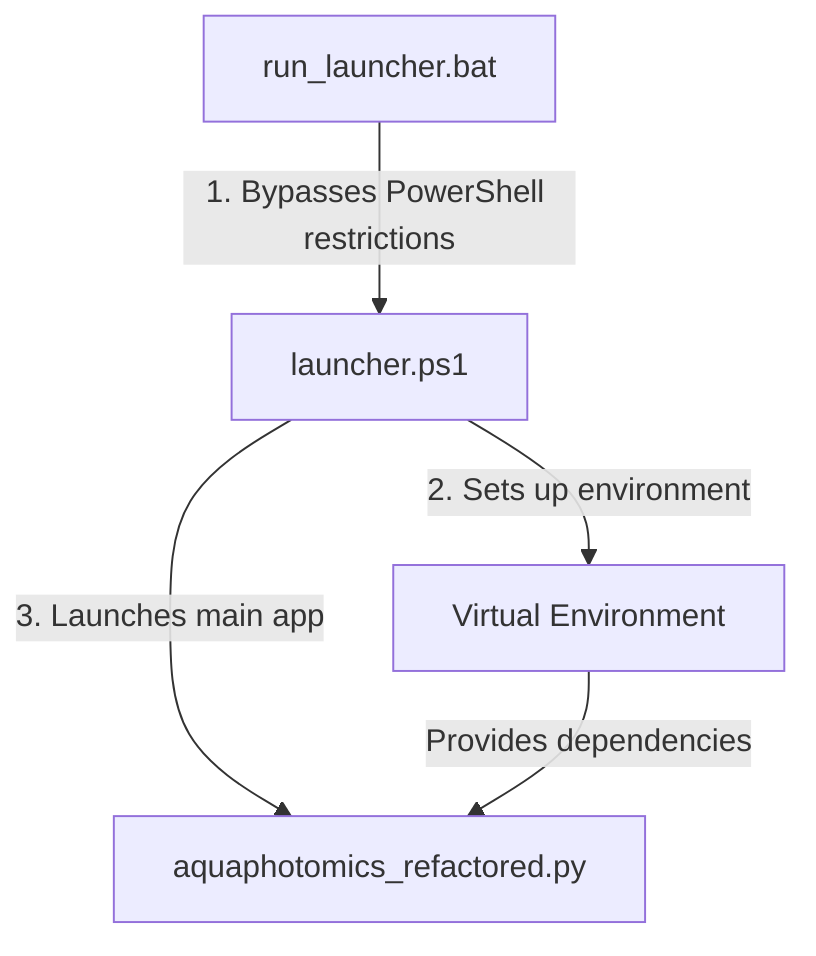

# Aquaphotomics Application Launch Flow

## 1. Entry Point: `run_launcher.bat`


## Detailed Execution Flow

### 1. `run_launcher.bat` Execution
- **Purpose**: Provides a Windows-friendly way to execute PowerShell scripts
- **Key Actions**:
  - Launches PowerShell with execution policy bypass
  - Uses `-NoProfile` for faster startup
  - Executes `launcher.ps1` in the same directory using `%~dp0`

### 2. `launcher.ps1` Environment Setup
- **Initial Checks**:
  - Verifies existence of main Python script
  - Checks for images directory
  - Validates virtual environment status

- **Environment Preparation**:
  ```mermaid
  flowchart LR
    A[Check Environment] -->|Missing| B[Run setup.ps1]
    A -->|Exists| C[Quick Start]
    B --> D[Create/Update venv]
    C --> E[Activate venv]
    D --> E
    E --> F[Launch Python App]
  ```

### 3. Python Application Launch
- **Final Stage**:
  - Activates virtual environment
  - Ensures UTF-8 encoding
  - Launches main Python application
  - Handles errors and provides debugging output

## Error Handling and Logging
- Creates `aquaphotomics_error.log` for general issues
- Creates `python_error.log` for Python-specific errors
- Provides detailed error messages and troubleshooting steps

## File Structure Analysis

### Critical Files
1. **`run_launcher.bat`**
   - Essential for Windows execution
   - Cannot be removed

2. **`launcher.ps1`**
   - Core setup and launch script
   - Contains critical environment setup logic
   - Cannot be removed

3. **`setup.ps1`**
   - Virtual environment creation
   - Package installation
   - Required for initial setup and updates

4. **`aquaphotomics_refactored.py`**
   - Main application entry point
   - Core application logic

### Supporting Directories
1. **`venv/`**
   - Python virtual environment
   - Generated/managed by setup scripts
   - Can be safely deleted and recreated

2. **`images/`**
   - Required for UI elements
   - Must be present for proper application function

## Cleanup Recommendations

### Safe to Remove
1. Any `.pyc` files (Python bytecode)
2. Old log files
3. Temporary files (`*.tmp`)
4. Backup files (`*.bak`)

### Must Keep
1. All launcher scripts (`run_launcher.bat`, `launcher.ps1`, `setup.ps1`)
2. Main Python application file
3. Required Python packages list
4. Image assets

### Consider Removing
1. Old versions of the application (if present)
2. Deprecated Python scripts
3. Unused test files
4. Development-only configuration files

## Development Notes
- The launcher system is designed to be self-contained
- Error handling is comprehensive with detailed logging
- Virtual environment ensures dependency isolation
- The setup process is automated for ease of deployment

## Future Improvements
1. Consider adding version control for Python packages
2. Implement backup system for critical files
3. Add automated cleanup of old log files
4. Consider adding a development/production mode switch 