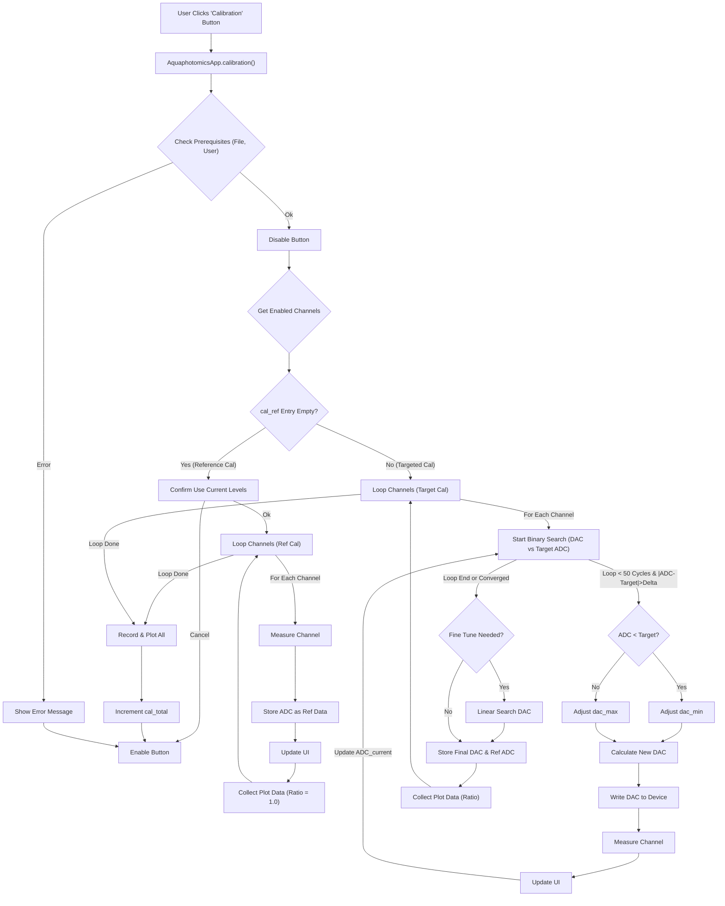

# Calibration Function Flow (`AquaphotomicsApp.calibration`)

## Logic

1.  Checks if a data file and user profile are set; shows info messages if not.
2.  Disables the calibration button during execution.
3.  Gets the list of enabled channels, sorted by their specified order.
4.  **If `cal_ref` is empty (Reference Calibration):**
    *   Asks for confirmation to proceed with current levels.
    *   Sets up data record with `REF_00000_...` event type.
    *   Clears and repopulates `self.data_processor.ref_data` with measured `adc_pulse` values.
    *   Measures each enabled channel using `self.device.measure_channel`.
    *   Updates UI ADC fields.
    *   Collects data for plotting (ratio `adc_pulse / ref_data`).
    *   Records data using `self.data_processor.record_data` and `self.data_processor.record_amplitude`.
    *   Plots data using `self.figures.plot_data`.
5.  **If `cal_ref` has a value (Targeted Calibration):**
    *   Sets up data record with `REF_<cal_ref>_...` event type.
    *   For each enabled channel:
        *   Performs a binary search (`while` loop, max 50 cycles) to find the DAC value (`dac_current`) that produces an ADC reading (`adc_current`) close to the target (`adc_ref`).
            *   Adjusts `dac_min` and `dac_max` based on comparison `adc_current` vs `adc_ref`.
            *   Calculates new `dac_current = (dac_min + dac_max) / 2`.
            *   Writes new DAC value to device using `self.device.write_signal_to_channel`.
            *   Measures new ADC value using `self.device.measure_channel`.
            *   Updates UI.
        *   Performs fine-tuning (linear search) in a small range around the found DAC value if the target wasn't met exactly.
        *   Raises an error if calibration cycles exceed 50.
        *   Updates the final DAC value in the UI (`self.channel_dac[channel].set(dac_current)`).
        *   Stores the final measured `adc_pulse` as the reference for this channel in `self.data_processor.ref_data`.
        *   Collects data for plotting (ratio `adc_pulse / ref_data`).
        *   Records data.
        *   Plots data.
6.  Increments `self.data_processor.cal_total`.
7.  Re-enables the calibration button in a `finally` block.

## Flowchart

