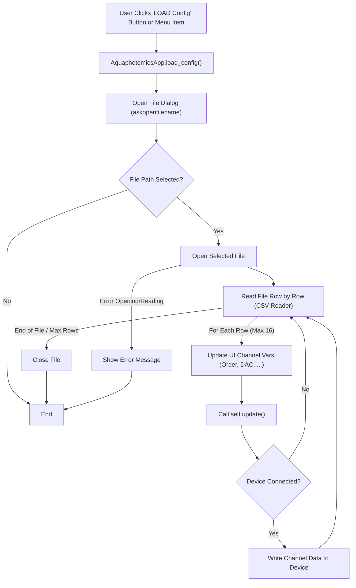

# Load Config Function Flow (`AquaphotomicsApp.load_config`)

## Logic

1.  Uses `tk_fd.askopenfilename` to get a `.cfg` file path.
2.  If a path is provided:
    *   Opens and reads the file using `csv.reader` (space-delimited).
    *   Iterates through the rows (up to 16).
    *   For each row, updates the UI `tk.StringVar` variables for that channel (order, dac, dac_pos, ton, toff, samples).
    *   Calls `self.update()`.
    *   If the device is connected (`self.device.connect_status`), calls `self.write_channel_data(num)` to write the loaded config for that channel to the device.
3.  Shows an error message if loading fails.

## Flowchart

