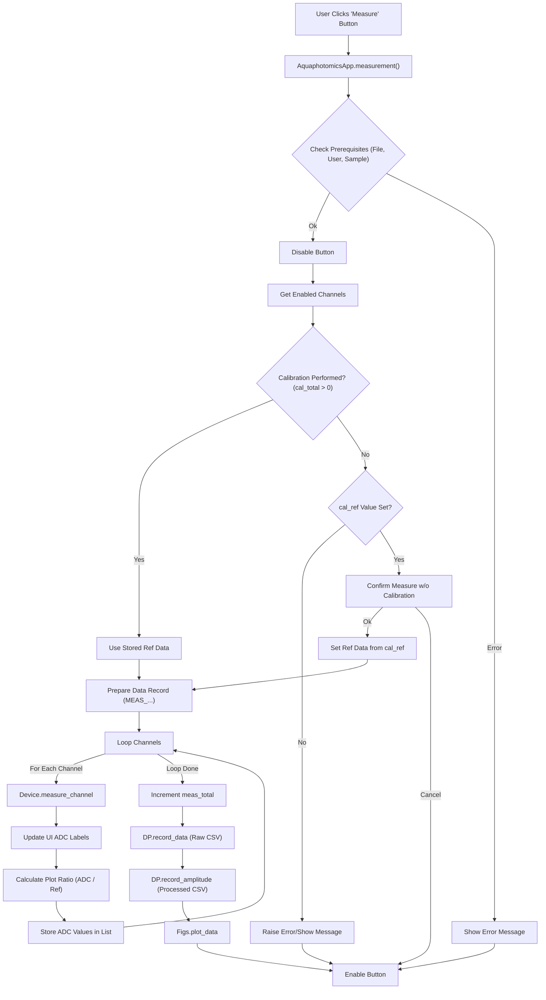

# Measurement Function Flow (`AquaphotomicsApp.measurement`)

## Logic

1.  Checks if data file, user profile, and sample type are set; shows info messages if not.
2.  Disables the measurement button during execution.
3.  Gets the list of enabled channels, sorted by order.
4.  Checks if calibration has been performed (`self.data_processor.cal_total > 0`).
5.  **If not calibrated:**
    *   Checks if `cal_ref` is set; raises error if not.
    *   Asks for confirmation to measure using `cal_ref` value without actual calibration.
    *   Sets `self.data_processor.ref_data` to `[float(self.cal_ref.get())] * 16`.
6.  Sets up data record with `MEAS_...` event type, including sample type.
7.  For each enabled channel:
    *   Measures ADC values using `self.device.measure_channel`.
    *   Updates UI ADC fields.
    *   Calculates plotting ratio `float(adc_pulse) / self.data_processor.ref_data[channel]`.
    *   Stores measured ADC values in `measure_data` list.
    *   Updates UI (`self.update()`).
8.  Increments `self.data_processor.meas_total`.
9.  Records data using `self.data_processor.record_data` and `self.data_processor.record_amplitude`.
10. Plots data using `self.figures.plot_data`.
11. Re-enables the measurement button in a `finally` block.

## Flowchart

</rewritten_file> 