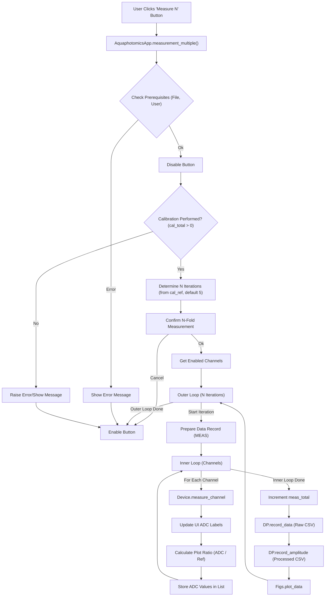

# Measurement Multiple Function Flow (`AquaphotomicsApp.measurement_multiple`)

## Logic

1.  Checks if data file and user profile are set.
2.  Disables the button during execution.
3.  Checks if calibration has been performed; raises error if not.
4.  Determines number of iterations (`n_iterations`) from `self.cal_ref` (default 5, min 1, max 10).
5.  Asks for confirmation.
6.  Gets the sorted list of enabled channels.
7.  Loops `n_iterations` times:
    *   Performs a single measurement sequence similar to `self.measurement` (measures all enabled channels, updates UI, collects data, records data, plots data).
    *   Increments `self.data_processor.meas_total` in each iteration.
8.  Re-enables the button in a `finally` block.

## Flowchart

</rewritten_file> 