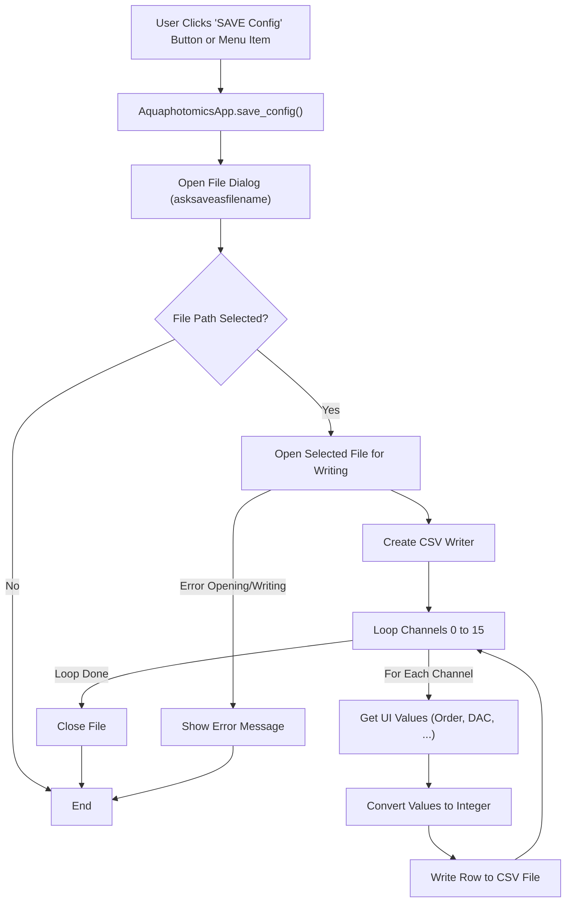

# Save Config Function Flow (`AquaphotomicsApp.save_config`)

## Logic

1.  Uses `tk_fd.asksaveasfilename` to get a `.cfg` file path.
2.  If a path is provided:
    *   Opens the file for writing using `csv.writer` (space-delimited).
    *   Iterates through channels 0 to 15.
    *   For each channel, retrieves the values from the UI `tk.StringVar` variables, converts them to `int`, and writes them as a row to the file.
3.  Shows an error message if saving fails.

## Flowchart

