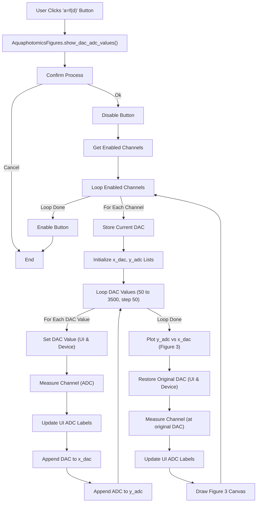

# Show DAC vs ADC Values Flow (`AquaphotomicsFigures.show_dac_adc_values`)

## Logic

1.  Asks for confirmation ("This is a hard process!").
2.  Disables the calling button (`a_button_handle`).
3.  Gets the sorted list of enabled channels based on `a_status` and `a_order`.
4.  For each enabled channel (`n_channel`):
    *   Stores the current DAC value.
    *   Initializes empty lists `x_dac` and `y_adc`.
    *   Loops through DAC values `x` from 50 to 3500 in steps of 50:
        *   Sets the DAC value in the UI (`a_dac_en`) and writes it to the device (`device.write_signal_to_channel`).
        *   Measures ADC values (`device.measure_channel`).
        *   Updates UI ADC fields (`a_adc_pulse`, etc.).
        *   Appends `x` to `x_dac` and `float(a_adc_pulse[n_channel].get())` to `y_adc`.
    *   Plots `y_adc` vs `x_dac` on Figure 3.
    *   Restores the original DAC value to the UI and device.
    *   Measures and updates UI ADC values with the restored DAC setting.
    *   Draws the canvas (`fig.canvas.draw()`).
5.  Re-enables the calling button in a `finally` block.

## Flowchart

