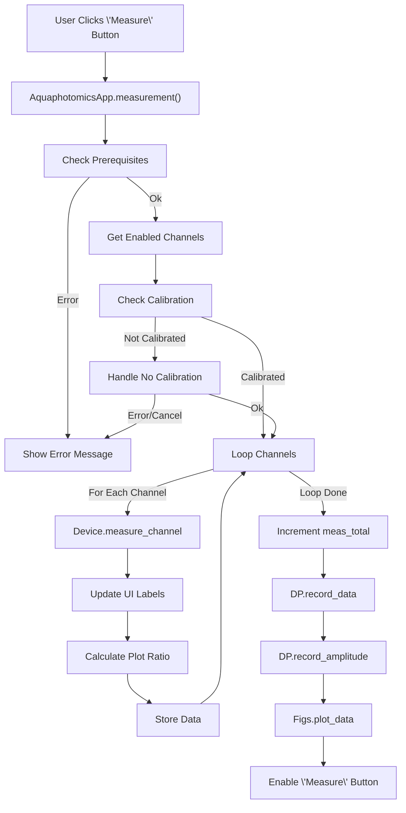

# Aquaphotomics Application Button Analysis

This document details the Tkinter buttons found in the `aquaphotomics_refactored.py` script, their associated command functions, and an analysis of those functions.

## Main Application Window (`AquaphotomicsApp`)

### Top Control Frame (`bframe`)

1.  **Button Text:** `Check COM`
    *   **Called Function:** `AquaphotomicsApp.check_com`
    *   **Description:** Checks if a connection can be established to the device on the currently selected COM port.
    *   **Logic:**
        1.  Retrieves the selected COM port from `self.com_var`.
        2.  If no port is selected, shows an error message.
        3.  Calls `self.device.connect(port)`.
        4.  Shows a success or error message box based on the connection result.
        5.  Returns `True` on success, `False` otherwise.
    *   **Parameters:** `self` (instance of `AquaphotomicsApp`)
    *   **Math:** None.

2.  **Button Text:** `Read Table`
    *   **Called Function:** `AquaphotomicsApp.read_table`
    *   **Description:** Reads the configuration parameters (DAC, Ton, Toff, Samples, DAC Pos) for all 16 channels from the connected hardware device and updates the UI table.
    *   **Logic:**
        1.  Iterates through channels 0 to 15.
        2.  For each channel, calls `self.read_channel_data(i)`.
        3.  Calls `self.update()` after each channel read (though the `update` method is currently empty).
    *   **Parameters:** `self`
    *   **Math:** None.

3.  **Button Text:** `Write Table`
    *   **Called Function:** `AquaphotomicsApp.write_table`
    *   **Description:** Writes the configuration parameters displayed in the UI table to the connected hardware device's EEPROM for all 16 channels.
    *   **Logic:**
        1.  Asks the user for confirmation via a message box (`tk_msg.askquestion`).
        2.  If confirmed ('yes'):
            *   Iterates through channels 0 to 15.
            *   For each channel, calls `self.write_channel_data(i)`.
            *   Calls `self.update()` after each channel write.
    *   **Parameters:** `self`
    *   **Math:** None.

4.  **Button Text:** `Select File`
    *   **Called Function:** `AquaphotomicsApp.select_data_file`
    *   **Description:** Opens a file dialog to allow the user to select or create a `.csv` file for saving measurement data.
    *   **Logic:**
        1.  Uses `tk_fd.asksaveasfilename` to get a file path from the user.
        2.  If a path is provided:
            *   Ensures the path ends with `.csv`.
            *   Calls `self.data_processor.set_data_file(file_path)` to initialize the data file (creates headers etc.).
    *   **Parameters:** `self`
    *   **Math:** None.

5.  **Button Text:** `Calibration`
    *   **Called Function:** `AquaphotomicsApp.calibration`
    *   **Description:** Performs a calibration routine. This can either record current ADC values as reference (if no target value is set) or adjust DAC settings for each enabled channel to achieve a target ADC value specified in the `cal_ref` entry field. Records calibration data and plots the results.
    *   **Logic:** [See detailed flow](./flowcharts/calibration_flow.md)
    *   **Parameters:** `self`
    *   **Math:**
        *   Binary Search midpoint: `dac_current = int((dac_min + dac_max) / 2)`
        *   Absolute difference check: `abs(adc_ref - adc_current) > DELTA_ADC`
        *   Plotting ratio: `r_value = float(adc_pulse) / self.data_processor.ref_data[channel]`
        *   Implicitly uses math from `MeasurementData.record_amplitude` (see section below).

6.  **Button Text:** `Measure`
    *   **Called Function:** `AquaphotomicsApp.measurement`
    *   **Description:** Performs a single measurement across all enabled channels using the current reference/calibration data. Records the measurement data and plots the results.
    *   **Logic:** [See detailed flow](./flowcharts/measurement_flow.md)
    *   **Parameters:** `self`
    *   **Math:**
        *   Plotting ratio: `r_value = float(adc_pulse) / self.data_processor.ref_data[channel]`
        *   Implicitly uses math from `MeasurementData.record_amplitude` (see section below).

7.  **Button Text:** `Measure N`
    *   **Called Function:** `AquaphotomicsApp.measurement_multiple`
    *   **Description:** Performs a specified number (N) of measurements sequentially, averaging the results is implied by the text but not actually implemented (it just plots each one). N is taken from the `cal_ref` entry field (defaults to 5 if empty).
    *   **Logic:** [See detailed flow](./flowcharts/measurement_multiple_flow.md)
    *   **Parameters:** `self`
    *   **Math:**
        *   Plotting ratio: `r_value = float(adc_pulse) / self.data_processor.ref_data[channel]`
        *   Implicitly uses math from `MeasurementData.record_amplitude` (see section below).
        *   `n_iterations = max(1, min(int(self.cal_ref.get()), 10))`

8.  **Button Text:** `a=f(d)`
    *   **Called Function:** Lambda -> `AquaphotomicsFigures.show_dac_adc_values`
    *   **Description:** Measures and plots the relationship between DAC settings and resulting ADC values (ADC = f(DAC)) for selected channels.
    *   **Logic (within `show_dac_adc_values`):** [See detailed flow](./flowcharts/show_dac_adc_values_flow.md)
    *   **Parameters (for `show_dac_adc_values`):** `self` (instance of `AquaphotomicsFigures`), `a_status` (list of channel status vars), `a_order` (list of channel order vars), `a_dac_en` (list of DAC entry vars), `a_adc_pulse`, `a_adc2_pulse`, `a_adc_back` (lists of ADC label vars), `a_button_handle` (the button widget itself).
    *   **Math:** `range(50, 3550, 50)`, `int()`, `float()`.

9.  **Button Text:** `Show Graph` / `Hide Graph`
    *   **Called Function:** `AquaphotomicsFigures.toggle_view`
    *   **Description:** Toggles the visibility of the window containing the plots (Linear, Polar, ADC=f(DAC)).
    *   **Logic (within `toggle_view`):**
        1.  Checks the current visibility state (`self.b_shown`).
        2.  If shown, calls `self.hide()`.
        3.  If hidden, calls `self.show()`.
        4.  `show()` and `hide()` methods in `AquaphotomicsFigures` call the base class methods (`self.root_window.deiconify()` / `self.root_window.withdraw()`) and update the button text accordingly.
    *   **Parameters:** `self` (instance of `AquaphotomicsFigures`)
    *   **Math:** None.

### Channel Table (`tframe`) - *16 instances for each button type*

1.  **Button Text:** `ON` / `OFF` (Toggles)
    *   **Called Function:** Lambda -> `AquaphotomicsApp.toggle_led`
    *   **Description:** Toggles the LED for the specific channel ON or OFF via a serial command.
    *   **Logic (within `toggle_led`):**
        1.  Checks if the device is connected.
        2.  Determines the desired state (1 for ON, 0 for OFF) based on the button's current text.
        3.  Updates the button's text and background color.
        4.  Sends the toggle command (`self.device.toggle_led(channel, state)`).
        5.  Shows an error message if the command fails.
    *   **Parameters (for `toggle_led`):** `self` (instance of `AquaphotomicsApp`), `button` (the specific button widget), `channel` (the channel index 0-15).
    *   **Math:** None.

2.  **Button Text:** `Read`
    *   **Called Function:** Lambda -> `AquaphotomicsApp.read_channel_data`
    *   **Description:** Reads the configuration data (DAC, Ton, Toff, Samples, DAC Pos) for this specific channel from the device and updates the corresponding entry fields in the UI row.
    *   **Logic (within `read_channel_data`):**
        1.  Checks if the device is connected.
        2.  Calls `self.device.read_signal_from_channel` for each signal type (0 to 4).
        3.  Updates the corresponding `tk.StringVar` for the channel (e.g., `self.channel_dac[channel].set(...)`).
        4.  Shows an error message if reading fails.
    *   **Parameters (for `read_channel_data`):** `self` (instance of `AquaphotomicsApp`), `channel` (the channel index 0-15).
    *   **Math:** None.

3.  **Button Text:** `Write`
    *   **Called Function:** Lambda -> `AquaphotomicsApp.write_channel_data`
    *   **Description:** Writes the configuration data entered in the UI row for this specific channel to the device's EEPROM.
    *   **Logic (within `write_channel_data`):**
        1.  Checks if the device is connected.
        2.  Calls `self.device.write_signal_to_channel` for each signal type (0 to 4), converting the value from the `tk.StringVar` (e.g., `int(self.channel_dac[channel].get())`) to an integer.
        3.  Shows an error message if writing fails.
    *   **Parameters (for `write_channel_data`):** `self` (instance of `AquaphotomicsApp`), `channel` (the channel index 0-15).
    *   **Math:** `int()`.

4.  **Button Text:** `Measure`
    *   **Called Function:** Lambda -> `AquaphotomicsApp.measure_channel`
    *   **Description:** Performs a measurement for this specific channel using the device and updates the ADC value display fields (ADC1, ADC2, ADC black) in the UI row.
    *   **Logic (within `measure_channel`):**
        1.  Checks if the device is connected.
        2.  Calls `self.device.measure_channel(channel)` to get `adc_pulse`, `adc2_pulse`, `adc_background`.
        3.  Updates the corresponding `tk.StringVar` for the channel's ADC labels (e.g., `self.channel_adc[channel].set(adc_pulse)`).
        4.  Shows an error message if measuring fails.
    *   **Parameters (for `measure_channel`):** `self` (instance of `AquaphotomicsApp`), `channel` (the channel index 0-15).
    *   **Math:** None.

### Bottom Control Frame (`cframe`)

1.  **Button Text:** `LOAD Config`
    *   **Called Function:** `AquaphotomicsApp.load_config`
    *   **Description:** Opens a file dialog to select a `.cfg` file and loads the channel configuration parameters from it into the UI table. Optionally writes the loaded configuration to the device if connected.
    *   **Logic:** [See detailed flow](./flowcharts/load_config_flow.md)
    *   **Parameters:** `self`
    *   **Math:** `int()` (implicitly via `write_channel_data` if device connected, though the values read from the file are strings initially set to StringVars).

2.  **Button Text:** `SAVE Config`
    *   **Called Function:** `AquaphotomicsApp.save_config`
    *   **Description:** Opens a file dialog to specify a `.cfg` file and saves the current channel configuration parameters from the UI table into that file.
    *   **Logic:** [See detailed flow](./flowcharts/save_config_flow.md)
    *   **Parameters:** `self`
    *   **Math:** `int()`.

3.  **Button Text:** `Sample List Edit`
    *   **Called Function:** `AquaphotomicsApp.edit_sample_list`
    *   **Description:** Opens a separate dialog window (`SampleListDialog`) that allows the user to add or remove items from the list of available sample types.
    *   **Logic:**
        1.  Creates an instance of `SampleListDialog`, passing the parent window (`self`), the current sample list (`self.sample_list`), and the sample combobox widget (`self.sample_combo`).
        2.  The `SampleListDialog` handles the editing logic internally.
    *   **Parameters:** `self`
    *   **Math:** None.

4.  **Button Text:** `New Measurement`
    *   **Called Function:** `AquaphotomicsApp.new_user`
    *   **Description:** Opens a dialog (`UserDialog`) to allow the user to enter their name and select/create a data file, effectively starting a new measurement session/user profile.
    *   **Logic:**
        1.  Creates an instance of `UserDialog`.
        2.  If the dialog returns a result (user name and file path):
            *   Stores the user info in `self.user`.
            *   Calls `self.data_processor.set_data_file` to initialize the data file.
            *   Updates the 'User' menu icon.
    *   **Parameters:** `self`
    *   **Math:** None.

## Dialog Windows

### `UserDialog`

1.  **Button Text:** `...`
    *   **Called Function:** `UserDialog.select_file`
    *   **Description:** Opens a file dialog specifically for selecting the user's data file within the "New User" dialog.
    *   **Logic:**
        1.  Uses `tk_fd.asksaveasfilename` repeatedly (`while True`) until a valid file is selected or the dialog is cancelled.
        2.  Handles confirmation if the selected file already exists.
        3.  Updates the `self.filename` (tk.StringVar) which is linked to the entry field in the dialog.
    *   **Parameters:** `self` (instance of `UserDialog`)
    *   **Math:** None.
    *   *Note: OK/Cancel buttons are standard `tk.simpledialog.Dialog` buttons handled internally by `validate` and `apply`.*

### `ConnectionDialog`

1.  **Button Text:** `Connect`
    *   **Called Function:** `ConnectionDialog.connect`
    *   **Description:** Attempts to connect to the serial device using the port selected in the dialog's combobox.
    *   **Logic:**
        1.  Gets the selected port from `self.port_val`.
        2.  Updates status label to "Connecting...".
        3.  Disables Connect/Refresh buttons.
        4.  Calls `self.device.connect(port)`.
        5.  If successful:
            *   Updates status label to "Connected".
            *   Sets `self.result = port`.
            *   Destroys the dialog window (`self.destroy()`).
        6.  If failed:
            *   Updates status label to "Failed...".
        7.  Re-enables buttons in a `finally` block.
    *   **Parameters:** `self` (instance of `ConnectionDialog`)
    *   **Math:** None.

2.  **Button Text:** `Refresh`
    *   **Called Function:** `ConnectionDialog.refresh_ports`
    *   **Description:** Rescans the system for available serial ports and updates the combobox list in the dialog.
    *   **Logic:**
        1.  Calls `self.device.scan_ports()`.
        2.  Updates the `values` of the `self.port_menu` combobox.
        3.  Sets the default selection to the first port if available.
        4.  Updates the status label.
    *   **Parameters:** `self` (instance of `ConnectionDialog`)
    *   **Math:** None.
    *   *Note: OK/Cancel buttons are standard `tk.simpledialog.Dialog` buttons handled internally by `validate` and `apply`.*

### `SampleListDialog`

1.  **Button Text:** `Add`
    *   **Called Function:** `SampleListDialog.add_item`
    *   **Description:** Adds the text currently in the entry field to the listbox and the internal `sample_list`.
    *   **Logic:**
        1.  Gets the text from `self.entry_var`, stripping whitespace.
        2.  If the text is not empty:
            *   Appends it to `self.sample_list`.
            *   Inserts it into the `self.listbox`.
            *   Clears the entry field.
    *   **Parameters:** `self` (instance of `SampleListDialog`)
    *   **Math:** None.

2.  **Button Text:** `Remove`
    *   **Called Function:** `SampleListDialog.remove_item`
    *   **Description:** Removes the currently selected item from the listbox and the internal `sample_list`.
    *   **Logic:**
        1.  Checks if an item is selected in `self.listbox`.
        2.  If selected:
            *   Gets the index of the selection.
            *   Removes the item at that index from `self.sample_list` using `pop()`.
            *   Deletes the item from the `self.listbox`.
            *   Clears the selection/index display labels.
    *   **Parameters:** `self` (instance of `SampleListDialog`)
    *   **Math:** None.

3.  **Button Text:** `OK`
    *   **Called Function:** `SampleListDialog.on_close`
    *   **Description:** Closes the dialog and updates the sample combobox in the main application window with the modified list.
    *   **Logic:**
        1.  Updates the `values` of the main application's `self.combo_box` with the current `self.sample_list`.
        2.  Destroys the dialog window (`self.dialog.destroy()`).
    *   **Parameters:** `self` (instance of `SampleListDialog`)
    *   **Math:** None.

## Figure Window (`FigureCollection` / `AquaphotomicsFigures`)

1.  **Button Text:** `Clear` (with Eraser Icon)
    *   **Called Function:** Lambda -> `FigureCollection.clear_plot`
    *   **Description:** Clears the plotted data (lines with `gid=self.GID_DATA`) from the specific plot tab (e.g., "Linear", "Aquagram Polar") after asking for confirmation.
    *   **Logic (within `clear_plot`):**
        1.  Asks for confirmation using `tk_msg.askokcancel`.
        2.  If confirmed:
            *   Gets the `Figure` object corresponding to the `name`.
            *   Iterates through the axes in the figure.
            *   Iterates through the lines in each axis.
            *   If a line's GID matches `self.GID_DATA`, sets its visibility to `False`.
            *   Redraws the figure's canvas (`fig.canvas.draw()`).
    *   **Parameters (for `clear_plot`):** `self` (instance of `FigureCollection`), `name` (name of the plot tab).
    *   **Math:** None.

## Mathematical Functions Detail (`MeasurementData.record_amplitude`)

This function is called by `calibration`, `measurement`, and `measurement_multiple` to calculate absorbance values.

*   **Constants:**
    *   \( K_{adc} = 45.7763672 \times 10^{-6} \) (Conversion factor)
*   **Input:** `data` list containing measurement results (`m_adc_1`, `m_adc_2`, `m_adc_black` for each channel).
*   **Calculations per channel:**
    1.  Calculate intermediate intensity-related values using arbitrary precision (`mpmath`):
        \[ I_{m, white1} = 10^{2.0 \times K_{adc} \times m_{adc1}} \]
        \[ I_{m, white2} = 10^{2.0 \times K_{adc} \times m_{adc2}} \]
        \[ I_{m, black} = 10^{2.0 \times K_{adc} \times m_{adc,black}} \]
    2.  Calculate signal intensity:
        \[ I_s = I_{m, white1} + I_{m, white2} - 2.0 \times I_{m, black} \]
    3.  If the event type indicates a reference measurement (`data[2].startswith('REF')`), store \( I_s \) as the reference for that channel:
        \[ I_{ref, channel} = I_s \]
    4.  Calculate absorbance (log ratio):
        \[ I_{abs, channel} = \log_{10} \left( \frac{I_{ref, channel}}{I_s} \right) \]
*   **Output:** Writes timestamp, header info, and calculated \( I_{abs} \) values for all 16 channels to the amplitude (`_log.csv`) file.

### Measurement Flow Example (`measurement` function)

